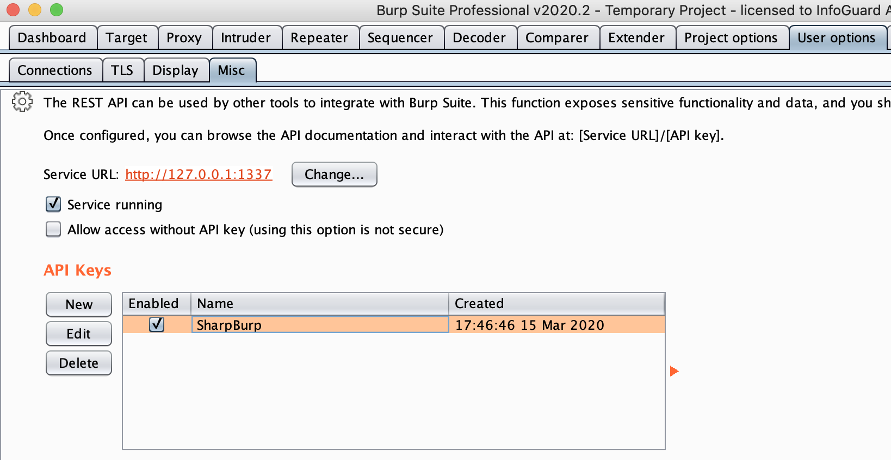

# SharpBurp

C# application, which parses a Nmap XML output file and allows sending 
selected HTTP services to the BurpSuite scanner.

## Configuration

In order to use BurpSharp, BurpSuite's REST API must be activated as 
depicted in the following screenshot:

During BurpSuite's setup, copy the configuration to SharpBurp as depicted 
in the following screenshot. Note that SharpBurp will permanently 
store all configuration:

## Usage

  1. Load one or more Nmap XML scan result files into SharpBurp by using 
  the button 'Load Nmap XML'. Per default, SharpBurp only imports open ports 
  (see checkbox 'Import Open').
  2. Tell SharpBurp, which URLs shall be sent to the Burp Suite Scanner 
  by checking or unchecking the respective checkboxes in column 'Scan'. In
  addition, the table's context menu can be used to check or unchek multiple 
  rows. Thereby, only HTTP services can be scanned (rows that contain 'http' in 
  column 'Nmap Name New').
  2. Choose BurpSuite's scan configuration and resource pool that shall be 
  used for the scans. The 'Scan Size' field tells SharpBurp how many URLs shall
  be scanned by one single BurpSuite scan. In other words, the total number of
  BurpSuite scans is the total number of selected rows (see status bar) 
  divided by the 'ScanSize'.
  5. Click button 'Send to Burp API' to send the selected URLs to the BurpSuite 
  Scanner.
  
## Author

  * **Lukas Reiter** (@chopicalquy) - [SharpBurp](https://github.com/chopicalqui/SharpBurp)

## License

This project is licensed under the GPLv3 License - see the
[license](https://github.com/chopicalqui/SharpBurp/blob/master/LICENSE) file for details.